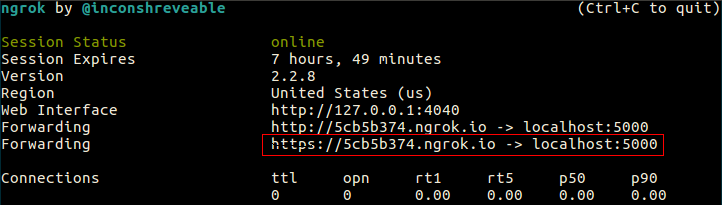
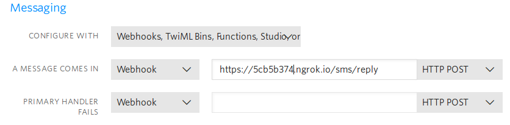

# Service prototype using Twilio API

TWILIO API offers the possibility to send and reply to SMS and to get access to your Twilio account from a program. This package shows some examples using python.

### Requirements

* twilio ~=6.0.0
* flask
* flask-sqlalchemy
* flask-migrate
* flask-login
* flask-admin
* flask-bootstrap


### Features

* Send SMS
* Reply to incoming SMS
* Retrieve message from messageSID
* Get the outbox list
* Get the inbox list
* Get the last message sent
* Get the count of sent messages
* Get the count of outbox messages
* Get the count of inbox messages


## Getting Started


Register on [Twilio](https://twilio.com) to get your Twilio account identifier and authentication token.

### Sending SMS and replying programmatically


#### Create and activate a virtual environment

To create a virtualenv run the following command:

```shell
			$ python3 -m venv env
```
Navigate to your virtualenv folder activate it with the following:

```shell
			$ source bin/activate
```

#### Setting environment variables

To protect the credentials, we avoid their direct declaration by defining the following environment variables.

```
			* **TW_ACCOUNT_SID** - your Twilio account identifier
			* **TW_AUTH_TOKEN** - your Twilio authentication token
			* **TW_PHONE_NR** - your Twilio phone number
```


```shell    
			(env) $ export TW_ACCOUNT_SID=Your_Twilio_Account_Identifier
```

```shell
			(env) $ export TW_AUTH_TOKEN=Your_Twilio_Authentication_Token
```

You can optionally add your Twilio phone number. 

```shell
			(env) $ export TW_PHONE_NR=Your_Twilio_Phone_Number
```

### Sending a SMS programmatically

To test the _send_ function, run inside the projet directory the following commands

```shell
			(env) $ python
			 ...
			 >>> from twlapi.sms import send
			 >>> send('+33062333xx', PHONE, 'Hi there!')
```	    
### Replying to incoming SMS from Flask


Install flask and other listed dependencies in your virtualenv with the following command:

```shell
			(env) $ pip install flask
			 ...
```
Inside the project directory, navigate to the folder flaskapp/

```shell
			(env) $ cd flaskapp
```

and set Flask environment variables:

```shell    
			(env) $ export FLASK_CONFIG=development
```

```shell
			(env) $ export FLASK_APP=run.py
```
You can now start the Flask APP with

```shell    
			(env) $ flask run
```
To see if the app is running open a browser and enter the following URL

> 	 http://127.0.0.1:5000

#### Using Ngrok

Download [Ngrok](https://ngrok.com/download) and unzip it at the location of your choice and run

```shell
			$ ./ngrok http 5000
```
Ngrok console is now started and you can see the given public URL



#### Configuring Twilio Webhook

This step defines the endpoint from where the reply is executed. The endpoint is composed of your Ngrok public URL and the path to the view, in this example 

>     /sms/reply

The URL of the endpoint is now:

>     https://5cb5b374.ngrok.io/sms/reply

To register the endpoint you need to configure the Twilio Webhook. On your Twilio dashboard navigate to your [phone number page](https://www.twilio.com/console/phone-numbers/incoming) and click on the number you'll like to use from the _Active Numbers_. On the configuration page of the selected phone number set the new URL of the endpoint as shown in the picture. 



The Flask APP is now ready to reply to incoming SMS.

    **Note that in Twilio trial version the phone number of incoming SMS should be registered on your Twilio account. 


The Flask APP shows in further examples how to interact with your Twilio account from a program / WebAPP.

Following actions are implemented in the app.

	| Path             | Return                            |
	|––––––––––––––––––|–––––––––––––––––––––––––––––––––– |
	|/sms/list         | list all sms                      |
	|/sms/inbox        | list of received sms              |
	|/sms/inbox/count  | count of received sms             |
	|/sms/outbox       | list of sms sent                  |
	|/sms/outbox/count | count of sms sent                 |
	|/sms/count        | count of all sms                  |
	|/sms/             | retrieve the last sms transaction |
	|/sms/reply        | reply to incoming sms             |
